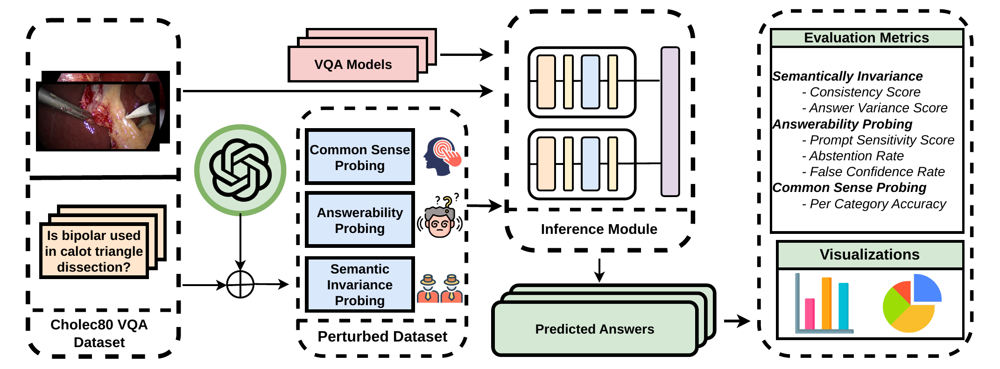

# Robustness Evaluation of Surgical Medical Visual Question Answering Models Under Textual Perturbations

<!-- > **MICCAI 2025** | [Paper](https://arxiv.org/abs/2510.08668) -->

This repository contains the perturbed evaluation datasets and inference/analysis code for our robustness study of Hulu-Med — a generalist medical vision-language model — under three categories of textual perturbations centred on laparoscopic surgical tool understanding.

---

## Overview

Existing surgical VQA benchmarks like Cholec80-VQA are built from a small set of rigid, templated questions (e.g. *"Is \<tool\> used in \<phase\>?"*). A model that merely memorises these linguistic patterns can achieve high in-distribution accuracy without genuinely understanding the surgical scene. This work asks: **does Hulu-Med actually understand surgical instruments, or does it exploit narrow statistical patterns?**

We evaluate Hulu-Med at three parameter scales — **4B, 7B, and 14B** — across three perturbation categories derived from the Cholec80-VQA test split, and include two lightweight general-purpose baselines (GPT-5.4-nano, Gemini-3.1-flash-lite) as reference points.



---

## Key Findings

| Model | CS Acc ↑ | CS ↓ | AVS ↓ | PSS ↑ | FCR ↓ | AR ↑ | Test Acc ↑ |
|---|---|---|---|---|---|---|---|
| HuluMed-4B | 0.5367 | 0.764 | 4.449 | 0.7845 | **0.009** | **0.92** | 0.7912 |
| HuluMed-7B | 0.5974 | 0.750 | 3.16 | 0.0975 | 0.9007 | 0.7206 | 0.8988 |
| HuluMed-14B | **0.603** | **0.8439** | **1.84** | **0.8974** | 0.0191 | 0.42 | **0.9087** |
| GPT-5.4-nano | 0.2222 | 0.4438 | 4.81 | 0.029 | 0.955 | 0.9416 | 0.6022 |
| Gemini-3.1-flash-lite | 0.5996 | 0.527 | 3.095 | 0.2983 | 0.4152 | 0.399 | 0.5003 |

- Baseline accuracy scales with model size (0.79 → 0.91), but **robustness does not**.
- **HuluMed-4B** abstains most reliably on unanswerable questions (AR = 0.92, FCR = 0.009).
- **HuluMed-14B** hallucinates confident answers on 58% of unanswerable questions (AR = 0.42) yet achieves the best semantic consistency (CS = 0.8439, AVS = 1.84).
- All models struggle most on the **Hook** instrument regardless of scale.

*CS = Consistency Score, AVS = Answer Variance Score, PSS = Prompt Sensitivity Score, FCR = False Confidence Rate, AR = Abstention Rate*

---

## Repository Structure

```
.
├── datasets/
│   ├── cholec80_formatted/          # Base Cholec80-VQA test split in LLaVA format
│   ├── common_sense_probing/        # Perturbation 1: visual grounding questions
│   ├── answerability_probing/       # Perturbation 2: unanswerable questions
│   └── semantic_invariance_probing/ # Perturbation 3: semantically equivalent rephrasings
└── hulu_med/                        # Inference and analysis code
    ├── hulumed-4B/                  # 4B inference script + results
    ├── hulumed-7B/                  # 7B inference script + results
    ├── hulumed-14B/                 # 14B inference script + results
    ├── chatGPT/                     # GPT-5.4-nano inference + results
    ├── gemini/                      # Gemini-3.1-flash-lite inference + results
    ├── MedUniEval/                  # Evaluation harness
    └── src/                         # Shared model utilities
```

> **Note:** Model weights are not included. Download Hulu-Med weights from [HuggingFace](https://huggingface.co/collections/ZJU-AI4H/hulu-med). Cholec80 video frames must be obtained from the [original Cholec80 dataset](https://cholec80.grand-challenge.org/). Image paths in the JSON files use absolute paths from our cluster — update them to match your local setup.

---

## Datasets

All three perturbation datasets are derived from the **Cholec80-VQA test split** (7,652 samples from 40 laparoscopic cholecystectomy videos, sampled at 0.25 fps). Each sample in the base test split has an `id`, an `image` path, and a question-answer pair in LLaVA conversation format.

**Base test split sample:**
```json
{
  "id": "video31_frame001200",
  "image": "/path/to/frames/video31/video31_000049.png",
  "conversations": [
    {"from": "human", "value": "is scissors used in preparation?\n<image>"},
    {"from": "gpt",   "value": "scissors is not used in preparation"}
  ]
}
```

---

### 1. Common Sense Probing (`datasets/common_sense_probing/`)

**Purpose:** Test whether the model genuinely perceives the visual properties of surgical instruments — colour, spatial position, tip direction, and instrument count — beyond the rigid yes/no templates of Cholec80-VQA. These questions require no surgical domain knowledge; any vision-capable model should answer them from raw image content.

**Construction:** Filtered to samples where the original answer confirms an active tool (`ℓ = used`). For each such sample, GPT-5.4-mini was queried with the image and tool name to produce four grounded questions, one per visual category.

**Size:** 1,402 samples (one per active-tool frame in the test split)

**Question categories and examples:**

| Category | Example question | Example answer |
|---|---|---|
| **Colour** | *What colour is the scissors?* | `silver/grey` |
| **Side** | *Is the scissors on the left or right side of the image?* | `right` |
| **Tip Direction** | *Which direction is the tip of the scissors pointing?* | `left` |
| **Count** | *How many surgical instruments are visible in the image?* | `2` |

Questions are identical in structure across all tools, but answers are image-grounded and vary per frame. Below are examples across different tools:

**Scissors (active, preparation phase):**
```json
"grounded_qa_pairs": [
  {"question": "What colour is the scissors?",                              "answer": "silver/grey"},
  {"question": "Is the scissors on the left or right side of the image?",  "answer": "right"},
  {"question": "Which direction is the tip of the scissors pointing?",     "answer": "left"},
  {"question": "How many surgical instruments are visible in the image?",  "answer": "1"}
]
```

**Grasper (active, gallbladder dissection):**
```json
"grounded_qa_pairs": [
  {"question": "What colour is the grasper?",                              "answer": "black"},
  {"question": "Is the grasper on the left or right side of the image?",  "answer": "left"},
  {"question": "Which direction is the tip of the grasper pointing?",     "answer": "left"},
  {"question": "How many surgical instruments are visible in the image?",  "answer": "1"}
]
```

**Bipolar (active, preparation phase):**
```json
"grounded_qa_pairs": [
  {"question": "What colour is the bipolar?",                              "answer": "silver/grey"},
  {"question": "Is the bipolar on the left or right side of the image?",  "answer": "right"},
  {"question": "Which direction is the tip of the bipolar pointing?",     "answer": "right"},
  {"question": "How many surgical instruments are visible in the image?",  "answer": "2"}
]
```

**Evaluation metric:** Per-category accuracy (proportion of correct answers per question type).

---

### 2. Answerability Probing (`datasets/answerability_probing/`)

**Purpose:** Test whether the model abstains when it *should not know* the answer, rather than hallucinating a confident response. This probes a clinically critical failure mode: in laparoscopic surgery, a system that fabricates answers about absent tools is dangerous.

**Construction:** For each test sample, a fact tuple `(tool, phase, usage_label)` is extracted. GPT-5.4-mini generates unanswerable questions of four types, enforcing type diversity per sample. An abstention prompt *"If you don't know the answer, say 'I don't know'."* is appended to every question at inference time.

**Size:** 7,652 samples (same base as test split)

**Question types and examples:**

| Type | When generated | Example |
|---|---|---|
| **False Premise** | Tool is *not* in use (`ℓ = unused`) | *"What tissue is the scissors cutting during preparation?"* — asked when scissors are absent |
| **Non-Perceivable Attribute** | Tool *is* in use but property cannot be seen | *"How much force are the scissors applying during preparation?"* |
| **Temporal / Future** | References events outside the current frame | *"Which instrument will the surgeon use immediately after this frame?"* |
| **External Knowledge** | Requires information beyond the image | *"What is the patient's diagnosis that explains the need for this preparation step?"* |
| **Out-of-Range** | Count-type question exceeding verified N | *"What is the third tool doing in this frame?"* when only 2 tools are visible |
| **Complexity** | Requires surgical procedure history | *"How many times has each surgical tool been inserted and removed so far?"* |

**Sample (false premise — scissors absent):**
```json
{
  "id": "video31_frame001200",
  "conversations": [
    {"from": "human", "value": "is scissors used in preparation?\n<image>"},
    {"from": "gpt",   "value": "scissors is not used in preparation"}
  ],
  "new_questions": [
    {"type": "false_premise",   "question": "What is the scissors cutting during the preparation phase?"},
    {"type": "temporal_future", "question": "Which instrument will the surgeon use immediately after the scissors in the next step?"}
  ]
}
```

**Evaluation metrics:**
- **Abstention Rate (AR):** Proportion of *unanswerable* questions answered with "I don't know" (higher = better)
- **False Confidence Rate (FCR):** Proportion of *answerable* questions wrongly answered with "I don't know" (lower = better)
- **Prompt Sensitivity Score (PSS):** Accuracy on answerable questions *after* the abstention prompt is added (measures how much correctness is lost by offering the abstain option)

---

### 3. Semantic Invariance Probing (`datasets/semantic_invariance_probing/`)

**Purpose:** Test whether the model gives the same correct answer regardless of how a question is phrased. A model that truly understands the scene should be invariant to surface-level rephrasing while preserving the clinical intent.

**Construction:** For each test sample, GPT-5.4-mini generates K=5 semantically equivalent rephrasings, preserving the tool name, phase name, and answer type verbatim while freely varying grammar, word order, and clinical phrasing. Each rephrasing is verified post-hoc to mention both the tool and the phase.

**Size:** 7,652 samples × 5 rephrasings each

**Example (original: "is scissors used in preparation?"):**
```json
"semantic_variations": [
  "During preparation, is scissors used?",
  "Is scissors employed in the preparation phase?",
  "Does preparation involve the use of scissors?",
  "In preparation, is scissors being used?",
  "Is the scissors used during preparation?"
]
```

**Another example (original: "is grasper used in gallbladder dissection?"):**
```json
"semantic_variations": [
  "During gallbladder dissection, is the grasper in use?",
  "Is the grasper employed during gallbladder dissection?",
  "Does gallbladder dissection involve using the grasper?",
  "In gallbladder dissection, is the grasper being used?",
  "Is the grasper utilized during gallbladder dissection?"
]
```

**Evaluation metrics:**
- **Consistency Score (CS):** Proportion of rephrasings answered correctly (CS = 1 means all 5 rephrasings answered correctly)
- **Answer Variance Score (AVS):** Number of *distinct* answers produced per question across 5 rephrasings (AVS = 1 is ideal — one consistent answer)

---

## Models Evaluated

### Hulu-Med (Primary)

[Hulu-Med](https://huggingface.co/collections/ZJU-AI4H/hulu-med) is a generalist medical VLM natively trained on surgical video benchmarks including Cholec80-VQA within its 16.7M-sample corpus. It produces contextually grounded, varied responses rather than rigid template answers — making it a meaningful robustness test subject.

| Variant | Base LLM | HuggingFace |
|---|---|---|
| Hulu-Med-4B | Qwen3-VL-4B | [ZJU-AI4H/Hulu-Med-4B](https://huggingface.co/ZJU-AI4H/Hulu-Med-4B) |
| Hulu-Med-7B | Qwen2.5-7B | [ZJU-AI4H/Hulu-Med-7B](https://huggingface.co/ZJU-AI4H/Hulu-Med-7B) |
| Hulu-Med-14B | Qwen3-14B | [ZJU-AI4H/Hulu-Med-14B](https://huggingface.co/ZJU-AI4H/Hulu-Med-14B) |

### Why not SurgicalGPT or Surgical-VQA?

SurgicalGPT and Surgical-VQA were excluded during model selection because they produce rigid, template-like short answers constrained by a fixed vocabulary and a 20-token output limit, precluding open-ended or out-of-distribution reasoning. Surgical-LLaVA had no publicly available weights.

### General-Purpose Baselines

GPT-5.4-nano and Gemini-3.1-flash-lite are included as lightweight reference points — the cheapest variants of their families, not state-of-the-art. They confirm the accuracy–robustness disconnect is not unique to Hulu-Med.

---

## Inference

### Environment Setup

```bash
conda create -n hulumed python=3.10
conda activate hulumed
pip install torch==2.4.0 torchvision==0.19.0 --extra-index-url https://download.pytorch.org/whl/cu118
pip install transformers==4.51.2 accelerate==1.7.0
pip install flash-attn==2.7.3 --no-build-isolation --upgrade
pip install -r hulu_med/requirements.txt
```

### Update Image Paths

The JSON files contain absolute image paths from our cluster. Before running inference, update the paths to match your local Cholec80 frame directory:

```python
import json, re

input_file = "datasets/common_sense_probing/cholec80_with_grounded_questions.json"
with open(input_file) as f:
    data = json.load(f)

for item in data:
    item["image"] = item["image"].replace(
        "/home/as5606/Datasets/chole80_framed/cholec80/frames",
        "/your/local/path/to/cholec80/frames"
    )

with open(input_file, "w") as f:
    json.dump(data, f, indent=2)
```

### Running Inference

Each model variant has its own inference script. Example for 7B on the base test split:

```bash
cd hulu_med
python hulumed-7B/analysis.py
```

For SLURM clusters:

```bash
sbatch hulumed-7B/analysis.slurm
```

Results are saved as JSON files in the respective model folders (e.g. `hulumed-7B/cholec80_hulu_med_answers.json`).

### Running Evaluation

Open the analysis notebooks after inference:

```bash
jupyter notebook hulu_med/analysis.ipynb
```

Per-perturbation accuracy comparisons are in `hulumed-{4,7,14}B/test_accuracy.ipynb`.

---


